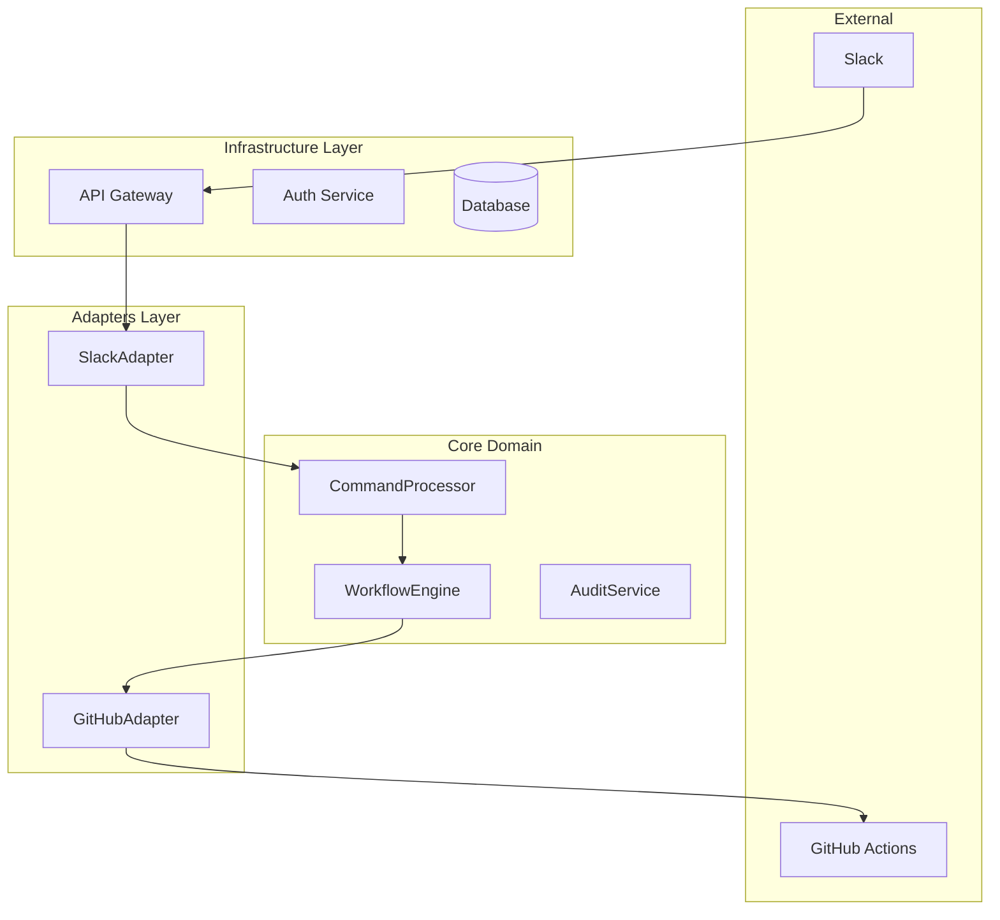

# Architecture Guide

## Overview

ChatOps follows a clean architecture pattern with clear separation of concerns:



## Layer Description

### Core Domain Layer
- Contains business logic and domain models
- Platform-agnostic
- Defines interfaces for external dependencies

### Adapters Layer
- Implements interfaces defined in core domain
- Handles platform-specific logic
- Converts external data formats to domain models

### Infrastructure Layer
- Provides technical capabilities
- Handles cross-cutting concerns
- Manages configuration and connections

## Key Components

### Command Processor
- Validates incoming commands
- Routes commands to appropriate handlers
- Manages command execution flow

### Repository Service
- Manages repository information
- Handles GitHub integration
- Stores repository metadata

### Workflow Engine
- Triggers GitHub Actions workflows
- Monitors workflow status
- Handles workflow results

## Data Flow

1. Slack command received by API Gateway
2. Command validated and transformed by SlackAdapter
3. CommandProcessor handles business logic
4. WorkflowEngine triggers appropriate actions
5. Results returned through the adapter chain

## Database Schema

### Repositories Table
```sql
CREATE TABLE repositories (
    id SERIAL PRIMARY KEY,
    name VARCHAR(255) NOT NULL UNIQUE,
    url VARCHAR(255) NOT NULL,
    default_branch VARCHAR(100) NOT NULL,
    added_by VARCHAR(100) NOT NULL,
    added_at TIMESTAMP NOT NULL,
    pipelines JSONB NOT NULL DEFAULT '[]',
    created_at TIMESTAMP NOT NULL DEFAULT CURRENT_TIMESTAMP,
    updated_at TIMESTAMP NOT NULL DEFAULT CURRENT_TIMESTAMP
);
``` 